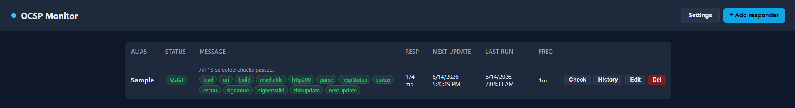
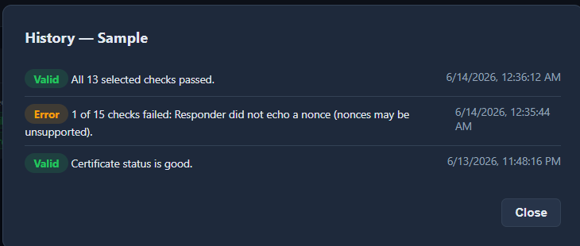
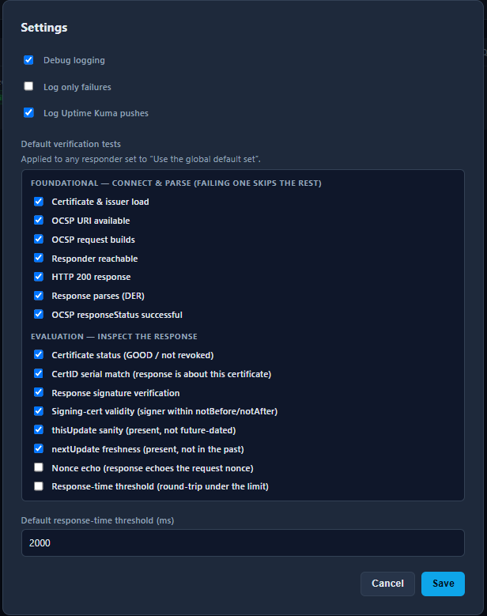
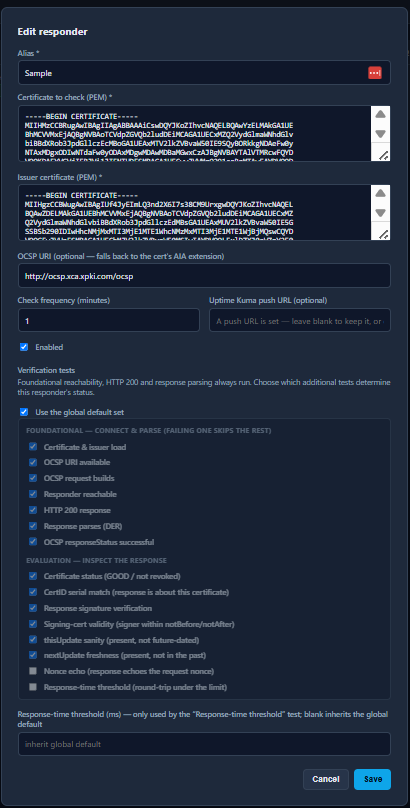

# OCSP Monitor (single-container edition)

A lightweight tool for monitoring OCSP responders. It periodically sends real
OCSP requests for the certificates you configure, records the result
(good / revoked / unknown / error), tracks response time and the
`thisUpdate` / `nextUpdate` window, keeps a history of status changes, and can
push results to Uptime Kuma.

This is a from-scratch rebuild of the original three-container stack
(MongoDB + Node API + React/Vite frontend) as a **single Flask container** with
no separate frontend and backend. That design removes the part that fought with
reverse proxies: the old React frontend tried to *guess* the backend URL from
the browser hostname and port. Here, the UI and API are served by the same
process on the same origin, and every request the browser makes is **relative**,
so the app works behind a reverse proxy — including under a subpath — with no
URL configuration.

## Screenshots

The dashboard lists every responder with its overall status and a coloured pill
per verification test (green = pass, red = fail, grey = skipped):



Each responder's history records status changes over time:



Settings holds the global default test selection (foundational vs. evaluation
groups) and the default response-time threshold:



Adding or editing a responder lets you pin its own test selection (or inherit
the global default) and set a per-responder response-time threshold:



## Why single-container

- **One upstream for your reverse proxy.** No CORS, no cross-service routing, no
  separate API port to expose.
- **No external database.** State lives in SQLite on a Docker volume. Fine for
  the intended scale of **fewer than ~30 responders**.
- **Built-in scheduler.** A background thread runs due checks; no cron, no job
  queue, no worker container.

## Quick start

```bash
git clone <this-repo> ocsp-monitor
cd ocsp-monitor
cp .env.example .env        # optional; defaults are sensible
docker compose up -d --build
```

Open <http://localhost:8080>. Click **+ Add responder** and provide:

- **Alias** — a name for the dashboard.
- **Certificate to check (PEM)** — the cert whose revocation status you want.
- **Issuer certificate (PEM)** — the CA cert that issued it (required to build
  the OCSP request).
- **OCSP URI** — optional. If left blank, the app uses the OCSP URL embedded in
  the certificate's AIA extension.
- **Frequency**, **Uptime Kuma URL**, **Enabled** — as needed.

The first check runs immediately; subsequent checks run on the schedule. Use
**Check** on any row to run an on-demand check.

## Configuration (environment variables)

| Variable | Default | Description |
|---|---|---|
| `PORT` | `8080` | Port the app listens on inside the container. |
| `URL_PREFIX` | *(empty)* | Subpath to mount under, e.g. `/ocsp`. Leave empty for root or a dedicated (sub)domain. |
| `SCHEDULER_INTERVAL` | `30` | How often (seconds) the scheduler looks for due checks. |
| `OCSP_TIMEOUT` | `30` | Per-request OCSP HTTP timeout (seconds). |
| `HISTORY_LIMIT` | `200` | Status-history rows retained per responder. |
| `LOG_LEVEL` | `INFO` | `DEBUG` / `INFO` / `WARNING` / `ERROR`. |
| `DATA_DIR` | `/data` | Where the SQLite DB is stored (mount a volume here). |
| `TRUSTED_PROXY_HOPS` | `1` | Proxy hops to trust for `X-Forwarded-*`. Set `0` to disable `ProxyFix` when exposed directly. |
| `OCSP_BLOCK_PRIVATE` | `true` | Block RFC 1918 / unique-local destinations for OCSP and Kuma fetches. |
| `OCSP_ALLOWED_HOSTS` | *(empty)* | Comma-separated hostnames / IPs / CIDRs that bypass the private-range block. |
| `MAX_PEM_BYTES` | `32768` | Maximum accepted size per PEM field. |
| `MAX_RESPONDERS` | `100` | Maximum responders (0 = unlimited). |
| `RATE_LIMIT_MUTATE` | `60` | Per-IP create/update/delete/settings requests per minute (0 = off). |
| `RATE_LIMIT_CHECK` | `20` | Per-IP on-demand check requests per minute (0 = off). |

## Security

This app has **no built-in authentication** — run it behind a reverse proxy
that handles auth, and on a trusted network. The hardening below reduces the
blast radius but does not replace access control.

- **SSRF egress controls.** The OCSP URI, the URL from a certificate's AIA
  extension, and the Uptime Kuma push URL are all validated before any
  server-side fetch: only `http`/`https` is allowed, redirects are disabled,
  and loopback / link-local (incl. the `169.254.169.254` cloud-metadata
  address) / multicast / reserved destinations are always blocked. Private
  (RFC 1918 / ULA) ranges are blocked too unless you set
  `OCSP_BLOCK_PRIVATE=false` — internal-PKI users monitoring private responders
  should instead allowlist them via `OCSP_ALLOWED_HOSTS` (hostnames, IPs, or
  CIDRs). Note: DNS-rebinding is only partially mitigated; prefer the allowlist
  for sensitive networks.
- **CSRF.** State-changing API requests require an `X-Requested-With` header and
  a JSON content type, which browsers can't send cross-origin without a CORS
  preflight the app never grants. Set `SameSite` on any session cookie you add.
- **Secrets.** The Uptime Kuma push URL embeds a token. It is stored in SQLite
  and **never returned by the API** (only a mask is shown) nor logged. Treat the
  data volume as secret-bearing and protect it. Editing a responder leaves the
  push-URL field blank to keep the existing value; type a new URL to replace it.
- **Error messages.** Network/parse errors are returned to clients as generic,
  category-level messages (full detail is logged server-side) so they can't be
  used as an SSRF reconnaissance oracle.
- **Abuse limits.** Per-IP rate limits on mutating and on-demand-check
  endpoints, a cap on PEM size, and a cap on responder count.
- **Direct exposure.** `docker-compose.yml` binds to `127.0.0.1`. If you expose
  the container directly, set `TRUSTED_PROXY_HOPS=0` so clients can't spoof
  `X-Forwarded-*` headers.

## Reverse proxy

The app trusts `X-Forwarded-For`, `X-Forwarded-Proto`, `X-Forwarded-Host`, and
`X-Forwarded-Prefix` (one proxy hop) via Werkzeug's `ProxyFix`.

### Own (sub)domain at root — simplest

Leave `URL_PREFIX` empty.

**nginx:**
```nginx
location / {
    proxy_pass http://127.0.0.1:8080;
    proxy_set_header Host              $host;
    proxy_set_header X-Real-IP         $remote_addr;
    proxy_set_header X-Forwarded-For   $proxy_add_x_forwarded_for;
    proxy_set_header X-Forwarded-Proto $scheme;
}
```

### Under a subpath, e.g. `https://host/ocsp`

Set `URL_PREFIX=/ocsp` (in `.env` or compose). The UI uses relative paths, so it
adapts automatically; setting the prefix makes the app respond at `/ocsp/...`
and correctly 404 elsewhere.

**nginx (no trailing slash on `proxy_pass`, so the `/ocsp` prefix is preserved):**
```nginx
location /ocsp/ {
    proxy_pass http://127.0.0.1:8080;
    proxy_set_header Host              $host;
    proxy_set_header X-Forwarded-For   $proxy_add_x_forwarded_for;
    proxy_set_header X-Forwarded-Proto $scheme;
    proxy_set_header X-Forwarded-Prefix /ocsp;
}
```

### Nginx Proxy Manager (NPM)

Create a Proxy Host, Forward Hostname/IP = the Docker host or container, Forward
Port = `8080`, scheme `http`. Enable **Websockets** is not required. For a
subpath, use the **Custom locations** tab with location `/ocsp` and the same
forward target, and set `URL_PREFIX=/ocsp`.

### Traefik (labels)

```yaml
labels:
  - "traefik.enable=true"
  - "traefik.http.routers.ocsp.rule=Host(`ocsp.example.com`)"
  - "traefik.http.services.ocsp.loadbalancer.server.port=8080"
```

### pfSense (HAProxy)

Point a backend server at the Docker host on port `8080`, attach it to the
frontend handling your hostname, and forward the standard `X-Forwarded-*`
headers (HAProxy does `X-Forwarded-For` by default). Use root deployment
(`URL_PREFIX` empty) for the least friction.

## How a check works

For each enabled responder whose `next_run` is due, the app:

1. Loads the certificate and issuer from stored PEM.
2. Builds a proper OCSP request with the `cryptography` library (SHA-1 `CertID`,
   per RFC 6960 — this is the hash of issuer name/key, not a signature digest)
   and HTTP-POSTs it to the OCSP URI (or the cert's AIA OCSP URL).
3. Parses the DER response, reads the certificate status, and extracts
   `thisUpdate` / `nextUpdate`. A `good` response whose `nextUpdate` is already
   in the past is flagged as an error (stale responder).
4. Stores status, message, response time, and the update window; appends a
   history row **only when the status changes**; optionally pushes to Uptime
   Kuma.

No `openssl` CLI is invoked — it's all in-process via `cryptography`.

## Selectable verification tests

Every step of a check is an individually selectable **test**, in two groups.

**Foundational tests** form a dependency chain — each one is a prerequisite for
the next. When one fails the check can't continue, so the dependent tests are
skipped. They're all on by default; deselecting one means its failure is still
recorded but no longer flips the responder to an error (use this only if you
deliberately don't want to alert on, say, an unreachable responder — note that
deselecting a foundational step can let a responder report `Valid` without
actually verifying anything).

| Foundational test | What it checks |
|---|---|
| **Certificate & issuer load** | Both PEMs parse into valid X.509 certificates. |
| **OCSP URI available** | A URI was supplied or found in the cert's AIA extension. |
| **OCSP request builds** | A well-formed OCSP request can be constructed. |
| **Responder reachable** | The HTTP POST to the responder succeeds. |
| **HTTP 200 response** | The responder returns status code 200. |
| **Response parses (DER)** | The body decodes as a DER OCSP response. |
| **responseStatus successful** | The OCSP-layer status is `successful` (not `tryLater`, `internalError`, …). |

**Evaluation tests** inspect a successfully parsed response:

| Evaluation test | What it checks |
|---|---|
| **Certificate status** | The certificate is `GOOD` — not `REVOKED` or `UNKNOWN`. |
| **CertID serial match** | The response's `CertID` serial number matches the certificate you asked about (guards against mismatched/substituted responses). |
| **Response signature** | The OCSP response is cryptographically signed by the issuer, or by a delegated responder cert that carries the `id-kp-OCSPSigning` EKU and was itself issued by that CA. |
| **Signing-cert validity** | The certificate that signed the response (issuer or delegated responder) is currently within its `notBefore`/`notAfter` window. |
| **thisUpdate sanity** | `thisUpdate` is present and not future-dated (allowing 5 min of clock skew). |
| **nextUpdate freshness** | `nextUpdate` is present and not already in the past (stale responder). |
| **Nonce echo** | A random nonce is sent with the request and the response must echo it back (RFC 8954) — detects replayed/cached responses. Off by default, since many responders don't support nonces. |
| **Response-time threshold** | The responder's round-trip time is under a configurable limit (ms). Off by default. |

Selection works at two levels:

- **Global default** (Settings → *Default verification tests*) applies to every
  responder that doesn't override it. Stored in the `default_tests` setting. The
  default set is everything *except* **Nonce echo** and **Response-time
  threshold**, which are opt-in.
- **Per responder** (Add/Edit → *Verification tests*) either inherits the global
  default or pins its own set. Untick **Use the global default set** to choose.

The **Response-time threshold** test reads its limit from the responder's own
*Response-time threshold (ms)* field, falling back to the global
*Default response-time threshold* in Settings (`default_response_time_ms`,
2000 ms out of the box).

The dashboard shows a coloured pill per test on each responder's row (green =
pass, red = fail, grey = skipped), and the overall status reflects only the
tests you enabled — e.g. disabling **Certificate status** means a revoked cert
won't flip the responder to `Revoked`, and disabling **nextUpdate freshness**
means a stale response won't be flagged as an error.

> **Note on public web certs:** Many public CAs have stopped including OCSP in
> their certificates (the CA/Browser Forum made OCSP optional in 2024). This
> tool is aimed at PKIs where OCSP is still required — e.g. federal PIV/PIV-I —
> and works against any responder that speaks RFC 6960.

## API

All endpoints are under `<prefix>/api`:

| Method | Path | Purpose |
|---|---|---|
| GET | `/api/status` | Health check (used by Docker HEALTHCHECK). |
| GET | `/api/responders` | List responders (no PEM payload). |
| POST | `/api/responders` | Create a responder. |
| GET | `/api/responders/{id}` | Get one responder (includes PEM). |
| PUT | `/api/responders/{id}` | Update a responder. |
| DELETE | `/api/responders/{id}` | Delete a responder. |
| POST | `/api/responders/{id}/check` | Run a check now. |
| GET | `/api/responders/{id}/history?limit=N` | Status-change history. |
| GET | `/api/tests` | Catalogue of selectable verification tests (`key` + `label`). |
| GET/PUT | `/api/settings` | Logging settings and the global `default_tests`. |

Responder objects carry a `tests` field: `null` means "inherit the global
default set", and an array of test keys (e.g. `["cert_status","signature"]`)
pins that responder's own selection. A `response_time_ms` field (or `null` to
inherit the global default) sets the limit for the response-time test. The most
recent per-test outcomes are returned in `last_checks`. The `uptime_kuma_url`
field is returned **masked** (the secret token is never exposed); a boolean
`uptime_kuma_url_set` indicates whether one is configured. On update, send a new
URL to replace it or omit/blank it to keep the stored value.

State-changing requests (`POST`/`PUT`/`DELETE`) must include an
`X-Requested-With` header and a JSON body, and are rate-limited per client IP.

## Data & backup

Everything is in the `ocsp_data` volume at `/data/ocsp_monitor.db`. Back it up
with:

```bash
docker compose exec ocsp-monitor sh -c "cat /data/ocsp_monitor.db" > backup.db
```

## Migrating from the old version

The data models map cleanly: old `certAlias` → `cert_alias`, `certPath` (PEM
content) → `cert_pem`, `issuerCertPath` → `issuer_pem`, `ocspUri` → `ocsp_uri`,
`frequencyMinutes` → `frequency_min`, `uptimeKumaUrl` → `uptime_kuma_url`. You
can re-add responders through the UI, or script POSTs to `/api/responders` from
a dump of the old MongoDB `ocspconfigs` collection.

## Notes

- Run with a **single** gunicorn worker (the Dockerfile does this) so the
  in-process scheduler runs exactly once. Concurrency for the handful of
  responders + UI comes from threads, which is plenty for I/O-bound OCSP calls.
- For more than a few dozen responders you'd want a real scheduler/queue and a
  client/server database — out of scope here by design.
